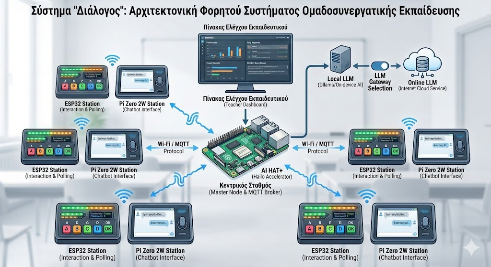

 # 👫  Διάλογος   🧑‍🤝‍🧑 

## Σχολικό Φορητό σύστημα ομαδοσυνεργατικής εκπαίδευσης (Chatbot , υποστήριξης μαθήματος και δημοσκοπήσεις - με επιλογή Local/Online  LLM)
center>

**Ομάδα:** DialogueTeam

**Σχολείο:** Λύκειακές Τάξεις Ακραιφνίου

**Διαγωνισμός:** 8ος Πανελλήνιος Διαγωνισμός Ανοιχτών Τεχνολογιών στην Εκπαίδευση

**Σχολική Χρονιά:** 2025-2026

**Θεματική Ενότητα:** Smart  Classroom, Παιδαγωγική Καινοτομία, Ανοιχτές Τεχνολογίες (IoT + AI)

Παρακάτω περιγράφεται η πρόταση έργου για τη συμμετοχή της ομάδας μας “DialogueTeam” στον διαγωνισμό, ως ένα επαναχρησιμοποιήσιμο και επεκτάσιμο σύστημα που ταιριάζει στη σχολική πραγματικότητα και μπορεί να υιοθετηθεί και από άλλα σχολεία.

---

## Κεντρική εικόνα συστήματος 

<!---->

>  * Σημείωση : Οι παραπάνω εικόνες έχουν παραχθεί με  τεχνητή νοημοσύνη ,   και  προσπαθούν να απεικονίζουν σφαιρικά  και όχι με ιδιαίτερες λεπτομέρειες την κεντρική ιδέα του προτεινόμενου έργου  (δίνεται έμφαση στο αποτέλεσμα και την περιγραφή του ) .   Προφανώς τεχνικά δεν είναι ακριβής και δεν αποτελούν   την απεικόνιση του τελικού παραδοτέου έργου *
---

# Α. Γενική Περιγραφή της Ιδέας

Το έργο **“Διάλογος”** είναι ένα φορητό, αρθρωτό οικοσύστημα “έξυπνης τάξης” που δίνει σε κάθε ομάδα μαθητών έναν **φυσικό σταθμό αλληλεπίδρασης** ώστε να:

1) χρησιμοποιεί ένα **Chatbot** (πρωτεύων στόχος),

2) υποστηρίζει καθημερινές λειτουργίες μαθήματος/τάξης (δεύτερος στόχος),

3) συμμετέχει σε δημοσκοπήσεις/ψηφοφορίες (τρίτος στόχος).

Η βασική ιδέα είναι ότι η τεχνολογία γίνεται “ορατή” και κοινόχρηστη μέσα στην τάξη: οι ομάδες δεν χρειάζεται να έχουν κινητά ή ατομικούς λογαριασμούς, γιατί η αλληλεπίδραση γίνεται μέσα από τους φορητούς σταθμούς.

### Δομή ανά ομάδα 

Κάθε ομάδα διαθέτει **δύο φορητούς σταθμούς**:

-  **Σταθμός ESP32 station:** κουμπιά (A/B/C/D/OK), φωτεινές ενδείξεις (RGB  LED) και προαιρετικά μικρή οθόνη (OLED) για απλές επιλογές, κατάσταση ομάδας και γρήγορες ψηφοφορίες.

-  **Σταθμός  Pi  Zero ** μικρή οθόνη + μικρόφωνο (push‑to‑talk) για  την  υποβολή  ερωτήσεων  στο  Chatbot  και  εμφάνιση  απάντησης.

### Κεντρικός σταθμός (1 για την τάξη/εργαστήριο)

-  **Raspberry  Pi 5** ως κεντρικός εξυπηρετητής/“εγκέφαλος”.

-  **AI  HAT+ (Hailo  accelerator 26 TOPS)** για επιτάχυνση εργασιών AI στο τοπικό σενάριο (όπου αυτό είναι εφικτό/χρήσιμο, ανάλογα με τις εφαρμογές που θα επιλεγούν στην υλοποίηση).

---

# Τι παρόμοιο υπάρχει – Τρέχουσα αντιμετώπιση προβλήματος

Σήμερα η χρήση AI στην τάξη γίνεται κυρίως με αποσπασματικές λύσεις (ιστοσελίδες, εφαρμογές κουίζ, εργαλεία τρίτων), που συνήθως προϋποθέτουν ατομικές συσκευές και σταθερή σύνδεση στο διαδίκτυο.

Ο “Διάλογος” προτείνει ένα ενιαίο σχολικό σύστημα:

- με **κοινόχρηστο hardware** ανά ομάδα,

- με **κεντρικό πίνακα ελέγχου** για τον εκπαιδευτικό,

- και με δυνατότητα επιλογής **Local/Online  LLM**, ώστε το σχολείο να μην εξαρτάται αποκλειστικά από εξωτερικές υπηρεσίες.

---

# Αναγκαιότητα του Έργου – Στόχοι

Η πρόταση στηρίζεται σε αρχές που κάνουν ένα σχολικό σύστημα βιώσιμο: ανοιχτές τεχνολογίες, αρθρωτότητα, επεκτασιμότητα, αξιοποίηση υπάρχουσας υποδομής και παραγωγή εκπαιδευτικών πόρων.

## Στόχος 1: Chatbot στην τάξη (κύριος)

- Οι ομάδες υποβάλλουν ερωτήσεις (φωνή/κείμενο) και λαμβάνουν απαντήσεις **με παιδαγωγικό έλεγχο** (π.χ. έγκριση εκπαιδευτικού όταν απαιτείται).

- Το σύστημα υποστηρίζει επιλογή ανά μάθημα/δραστηριότητα: **Local  LLM** (λειτουργία και χωρίς internet) ή **Online  LLM** (όταν χρειάζεται ισχυρότερο μοντέλο).

## Στόχος 2: Υποστήριξη μαθήματος/λειτουργιών τάξης

- “Χρειάζομαι βοήθεια”, “είμαστε έτοιμοι”, “χρειαζόμαστε επανάληψη”, χρονόμετρα δραστηριοτήτων, μικρές οδηγίες ανά ομάδα.

- Συγκεντρωτική εικόνα στον εκπαιδευτικό για διαφοροποίηση διδασκαλίας (πού δυσκολεύεται η τάξη, ποια ομάδα προχωρά, ποια χρειάζεται υποστήριξη).

## Στόχος 3: Δημοσκοπήσεις και ψηφοφορίες

- Γρήγορες ψηφοφορίες (A/B/C/D), “1–2 ερωτήσεις αναστοχασμού”, έλεγχος κατανόησης σε πραγματικό χρόνο.

- Άμεση προβολή αποτελεσμάτων στον πίνακα για συζήτηση/αναστοχασμό.

---

# Η καινοτομία του “Διάλογος”

1)  **Ανοιχτή, αρθρωτή αρχιτεκτονική**: οι σταθμοί είναι ανεξάρτητες μονάδες που επικοινωνούν με ανοιχτά πρωτόκολλα και μπορούν να προστεθούν/αφαιρεθούν σταδιακά.

2)  **“AI με κανόνες σχολείου”**: οι απαντήσεις μπορούν να φιλτράρονται/εγκρίνονται πριν εμφανιστούν δημόσια, ώστε η AI να ενισχύει το μάθημα χωρίς να το “απορρυθμίζει”.

3)  **Επιλογή Local/Online  LLM με ενιαίο τρόπο χρήσης**: ένα κεντρικό σημείο ρυθμίσεων επιτρέπει εναλλαγή μοντέλου ανά ανάγκη.

4)  **Ανεξαρτησία από προμηθευτές**: ο κορμός είναι ανοιχτός και επεκτάσιμος, ώστε το σχολείο να μπορεί να συντηρεί και να εξελίσσει το σύστημα.

---

# Β. Δομή – Χρήση – Υλοποίηση του Συστήματος

Το “Διάλογος” υλοποιείται ως κατανεμημένο σύστημα: κεντρικός σταθμός + φορητοί σταθμοί ομάδων, με επικοινωνία μέσω Wi‑Fi  και **MQTT**, ώστε  να  είναι  ελαφρύ, αξιόπιστο  και  επεκτάσιμο.

## 1. Κεντρικός Εξυπηρετητής (Raspberry  Pi 5)

**Κύριες λειτουργίες:**

- MQTT  broker και διαχείριση επικοινωνίας όλων των σταθμών.

- Πίνακας ελέγχου εκπαιδευτικού (συγκεντρωτικά αποτελέσματα, αιτήματα ομάδων, ροή ερωτήσεων).

- Καταγραφή συμβάντων (logs) και εξαγωγή αναφορών/δεικτών (συμμετοχή, χρόνοι απόκρισης, συχνότητα ερωτήσεων ανά ενότητα).

-  **Πύλη LLM (LLM  Gateway):** ένα ενιαίο “σημείο” που λαμβάνει ερωτήσεις και τις στέλνει είτε σε local είτε σε online μοντέλο.

## 2. Σταθμός Ομάδας ESP32 (άμεση αλληλεπίδραση)

**Δυνατότητες:**

- Γρήγορες επιλογές σε δημοσκοπήσεις/κουίζ (A/B/C/D).

- Κατάσταση ομάδας (βοήθεια/έτοιμοι/παύση).

- Φωτεινές ενδείξεις για ανατροφοδότηση (π.χ. “ελήφθη”, “αναμονή”, “εγκρίθηκε”, “ξαναπροσπάθησε”).

## 3. Σταθμός Ομάδας Raspberry  Pi  Zero 2W (μικρός σταθμός Chatbot)

**Δυνατότητες:**

- Υποβολή ερώτησης στο Chatbot (push‑to‑talk  ή  σύντομο  κείμενο).

- Εμφάνιση απάντησης (σε μικρές, ελεγχόμενες “δόσεις” πληροφορίας).

- Εμφάνιση βημάτων δραστηριότητας/οδηγιών ανά ομάδα.

## 4. Πίνακας ελέγχου εκπαιδευτικού

- Εμφάνιση σε υπολογιστή εκπαιδευτικού ή διαδραστικό πίνακα.

- Προβολή “κατάστασης τάξης” σε πραγματικό χρόνο και δυνατότητα έναρξης δραστηριοτήτων (π.χ. “άνοιξε δημοσκόπηση”, “στείλε οδηγίες στις ομάδες”).

## 5. Επιλογή Local/Online  LLM (τεχνική πρόταση)

**Local  LLM:** Χρησιμοποιούμε τοπική υποδομή ώστε να υπάρχει λειτουργία ακόμα και χωρίς internet, και να παραμένουν δεδομένα εντός σχολείου.

Ως πρακτική λύση, το **Ollama** παρέχει OpenAI‑compatible  API (chat  completions), ώστε  το  ίδιο  λογισμικό  να  δουλεύει  με  τοπικά  μοντέλα  χωρίς  αλλαγές  στον  κώδικα  της  εφαρμογής.

**Online  LLM:** Εναλλακτικά, η ίδια πύλη δρομολογεί προς διαδικτυακό πάροχο όταν χρειάζεται υψηλότερη ποιότητα/γνώση/ταχύτητα.

(Προαιρετικό) **Open  WebUI** μπορεί να χρησιμοποιηθεί ως εύχρηστη διεπαφή για διαχείριση/δοκιμές, υποστηρίζοντας Ollama και OpenAI‑compatible  endpoints.

---

# Ροές Λειτουργίας (Σενάρια)

## Σενάριο 1: Chatbot στην ομάδα (κύριο σενάριο)

1. Η ομάδα υποβάλλει ερώτηση από το Pi  Zero 2W.

2. Ο κεντρικός σταθμός λαμβάνει το αίτημα μέσω MQTT.

3. Η πύλη LLM επιλέγει Local ή Online  LLM σύμφωνα με ρύθμιση εκπαιδευτικού/κανόνες.

4. Η απάντηση επιστρέφει στην ομάδα, και προαιρετικά εμφανίζεται στην “ουρά έγκρισης” πριν προβληθεί δημόσια.

## Σενάριο 2: Υποστήριξη λειτουργιών μαθήματος

- Οι ομάδες δηλώνουν “βοήθεια/έτοιμοι/δυσκολία” από ESP32.

- Ο εκπαιδευτικός βλέπει συγκεντρωτικά και διαφοροποιεί τη διδασκαλία.

## Σενάριο 3: Δημοσκόπηση/γρήγορο κουίζ

- Ο εκπαιδευτικός ανοίγει ερώτηση.

- Κάθε ομάδα απαντά από ESP32.

- Τα αποτελέσματα προβάλλονται και γίνεται συζήτηση/αναστοχασμός.

---

# Προσβασιμότητα – Υποστήριξη ατόμων με ειδικές ανάγκες

Ο “Διάλογος” μπορεί να λειτουργήσει ως εργαλείο **συμπερίληψης**:

-  **Μαθητές με δυσκολίες λόγου/επικοινωνίας:** απαντούν/δηλώνουν ανάγκες με κουμπιά (ESP32), χωρίς την πίεση της δημόσιας έκθεσης.

-  **Μαθητές με προβλήματα ακοής:** το σύστημα δίνει έντονες οπτικές ενδείξεις (χρώματα/εικονίδια/μεγάλη γραμματοσειρά) και μπορεί να εμφανίζει κείμενο οδηγιών.

-  **Μαθητές με δυσλεξία/μαθησιακές δυσκολίες:** δυνατότητα απλών, “σπασμένων” οδηγιών βήμα‑βήμα  και  προσαρμοσμένου  ρυθμού, ενισχύοντας  την  αυτονομία.

-  **Μαθητές με ΔΕΠΥ:** χρονόμετρα, μικρές σαφείς οδηγίες, άμεση ανατροφοδότηση και “μικρο‑στόχοι”  ανά  δραστηριότητα.

---

# Εκπαιδευτική Αξία – Παραγόμενοι πόροι – Παιδαγωγική αξιοποίηση

Το έργο σχεδιάζεται σαν ένα “ζωντανό εργαστήριο” όπου οι μαθητές δημιουργούν, δοκιμάζουν, τεκμηριώνουν και αξιολογούν ένα πραγματικό σύστημα που εξυπηρετεί την τάξη τους.

## Δεξιότητες που καλλιεργούνται

-  **Πληροφορική/IoT:** MQTT επικοινωνία, αρχιτεκτονική κόμβων, βασική κυβερνοασφάλεια σχολικού συστήματος, δοκιμές και καταγραφή συμβάντων.

-  **Προγραμματισμός:** Python (υπηρεσίες/λογική/πύλη LLM), HTML/CSS/JavaScript (πίνακας ελέγχου), προγραμματισμός ESP32.

-  **AI γραμματισμός:** σωστή διατύπωση ερωτήσεων, έλεγχος αξιοπιστίας, εντοπισμός λαθών/παραισθήσεων, τεκμηρίωση πηγών, κανόνες υπεύθυνης χρήσης.

## Εκπαιδευτικοί πόροι που θα παραχθούν (ανοιχτοί)

- Φύλλα εργασίας “MQTT & IoT στην πράξη”.

- Φύλλα εργασίας “LLM στην τάξη: κανόνες, όρια, αξιοπιστία”.

- Οδηγός εκπαιδευτικού (σενάρια μαθήματος με χρήση Chatbot ανά ομάδα).

- Οδηγοί κατασκευής/συναρμολόγησης σταθμών (ESP32 & Pi  Zero 2W).

- Βίντεο tutorials (ρύθμιση, χρήση, αντιμετώπιση προβλημάτων).

- Πρότυπα “rubrics” αξιολόγησης ομαδικής εργασίας και συμμετοχής.

## Παιδαγωγικές μέθοδοι που υποστηρίζονται

-  **Μάθηση μέσω έργου (Project‑Based  Learning):** οι  μαθητές  σχεδιάζουν/υλοποιούν/βελτιώνουν  σύστημα  πραγματικής  χρήσης.

-  **Συνεργατική μάθηση:** ρόλοι ανά ομάδα (hardware, λογισμικό, τεκμηρίωση, δοκιμές), και συνεργασία μεταξύ ομάδων.

-  **Διερευνητική μάθηση (Inquiry‑Based):** οι  ομάδες  κάνουν  ερωτήσεις, ελέγχουν  απαντήσεις, σχεδιάζουν  πειράματα/παραδείγματα  για  επιβεβαίωση.

-  **Διαμορφωτική αξιολόγηση:** μικρο‑κουίζ/exit  tickets  και  άμεση  ανατροφοδότηση  που  οδηγεί  σε  προσαρμογή  διδασκαλίας.

-  **Διδασκαλία από ομότιμους (Peer  Instruction):** ομάδες παρουσιάζουν λύσεις/τεχνικές, ανταλλάσσουν προσεγγίσεις, τεκμηριώνουν “καλές πρακτικές”.

-  **Καθολικός Σχεδιασμός για Μάθηση (UDL):** πολλαπλοί τρόποι συμμετοχής (κουμπιά/κείμενο/φωνή/οπτικά σήματα) ώστε να μειώνονται εμπόδια πρόσβασης.

---

# Κοινωνική Επίδραση

Το “Διάλογος” έχει κοινωνική επίδραση σε επίπεδο σχολικής μονάδας και εκπαιδευτικού συστήματος, γιατί προτείνει ένα επαναχρησιμοποιήσιμο, ανοιχτό πρότυπο “AI στην τάξη με παιδαγωγικό έλεγχο”.

## Για παρακολούθηση εκπαιδευτικής διαδικασίας

- Παρέχει μετρήσιμα στοιχεία (συμμετοχή, ροή ερωτήσεων, αποτελέσματα μικρο‑αξιολογήσεων) που  μπορούν  να  στηρίξουν  τεκμηριωμένη  παιδαγωγική  συζήτηση.

- Αποτελεί πρότυπο εφαρμογής ανοιχτών τεχνολογιών και υπεύθυνης ενσωμάτωσης AI, με δυνατότητα αναπαραγωγής.

## Για εκπαιδευτικούς

- Μειώνει “θόρυβο” και άναρχες ατομικές χρήσεις AI, εισάγοντας κοινό κανάλι και κανόνες τάξης.

- Υποστηρίζει διαφοροποίηση και πιο στοχευμένη βοήθεια, με βάση πραγματικά σήματα από τις ομάδες.

## Για μαθητές και γονείς

- Δίνει ισότιμη πρόσβαση σε βοήθεια/συμμετοχή (ιδιαίτερα όταν δεν υπάρχουν ατομικές συσκευές).

- Ενισχύει τη συμπερίληψη και την αυτονομία μαθητών με ειδικές εκπαιδευτικές ανάγκες.

- Αναδεικνύει ότι η τεχνολογία μπορεί να υπηρετήσει κοινωνικές ανάγκες με υπευθυνότητα και ανοιχτότητα.

---

# Λίστα Υλικών – Πιλοτικό σύστημα (2 ομάδες)

> Στόχος του πιλοτικού είναι **"mini"-πλήρης λειτουργία** με 2 ομάδες, ώστε να υπάρχει πραγματική εικόνα τάξης, και στη συνέχεια κλιμάκωση/βελτιστοποίηση .

## Κεντρικός σταθμός (1x)

- 1x  Raspberry  Pi 5 (kit)

- 1x Αποθήκευση (microSD/SSD – θα αποφασιστεί στην υλοποίηση)

- 1x Αξιόπιστη δικτύωση (ιδανικά Ethernet)

- 1x AI HAT+ με Hailo accelerator (26 TOPS)(προεραιτικά – θα αποφασιστεί στην υλοποίηση)

## Ανά ομάδα (2x σετ)

### ESP32 station (1x ανά ομάδα)

- 1x ESP32 

- Κουμπιά A/B/C/D/OK

- 1x  RGB  LED (ή μικρή λωρίδα)

- (Προαιρετικά) 1x  OLED

- Θήκη + καλώδια + τροφοδοσία

### Raspberry Pi Zero 2W station (1x ανά ομάδα)

- 1x Raspberry Pi Zero 2W

- 1x μικρή οθόνη

- 1x μικρόφωνο (push‑to‑talk)

- Θήκη + καλώδια + τροφοδοσία

## Υποστηρικτικά υλικά

- Καλώδια, breadboard όπου χρειάζεται, αντιστάσεις, διακόπτες

- Υλικά για ανθεκτικές φορητές θήκες (ώστε να αντέχουν σχολική χρήση)

---

# Μελλοντικές Επεκτάσεις (κλιμάκωση)

Όπως και σε προηγούμενες προσεγγίσεις “έξυπνου σχολείου”, ο “Διάλογος” σχεδιάζεται για να επεκταθεί χωρίς να ξαναγραφτεί από την αρχή.

Ενδεικτικά:

1) Περισσότερες ομάδες/τάξεις και “βιβλιοθήκη δραστηριοτήτων” για διαφορετικά μαθήματα.

2) Τοπική βάση γνώσης (σημειώσεις, οδηγίες, υλικό σχολείου) ώστε το Chatbot να απαντά με βάση σχολικό περιεχόμενο.

3) Προσθήκη νέων IoT λειτουργιών (π.χ. επιπλέον οθόνες ενημέρωσης/ανακοινώσεων), αξιοποιώντας τον ίδιο κορμό MQTT και τον ίδιο πίνακα ελέγχου.

---

# Κατασκευή

---

Επόμενη Φάση

---

# Εκπαιδευτικό  Υλικο

---
Επόμενη Φάση

---
# Σχεδια μαθήματος

---
Επόμενη Φάση

---

# Σύνδεσμοι – Αναφορές

- (θα προστεθούν σύνδεσμοι του αποθετηρίου, τεκμηρίωσης και υλικού)

- 

---
